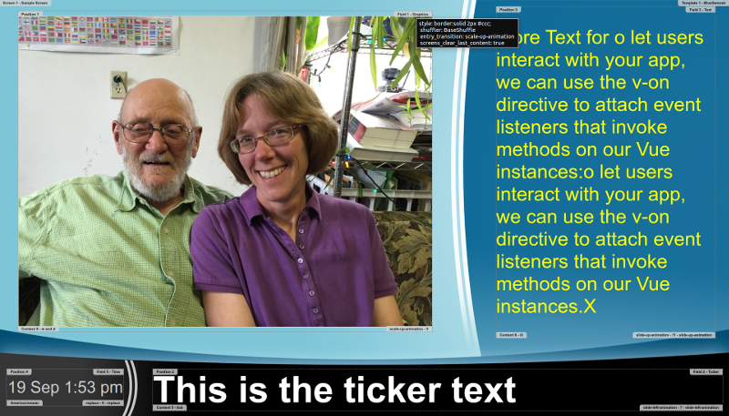

# concerto-frontend-vue

A replacement frontend plugin for Concerto Digital Signage that uses Vue.js.  Clicking on the content in a field will advance to the next piece of content.  Animate.css is used for animations.

Notice: this does not handle dynamic content plugins like the concerto-frontend plugin that was written in polymer did-- but that's ok, I think there were only two (concerto-remote-video and concerto-iframe) and they have both been included here.  So, if you have your own custom content types you will need to add them to the components directory and rebuild and republish the changes.

Videos are set to autoplay. Locales and timezones are supported for the time field. No scrollbars for iframes. The debug mode has informational tags.  There is no title or tooltip or alt text when not in debug mode. The document outline is discussed below for ease of applying your own template's CSS.



## Developing
```
npm install
npm run serve
```

The attributes in the <app/> element in the public/index.html file specify which screen to load.

To add a new content type component simply add it to the components directory, and import it in the ConcertoField.vue component and include it in its component list.  Each component gets a `content` prop that contains the content to display.

This application was initially generated from the vue-cli version 3.

### Brief Overview

The index.html contains the starting point-- the #app element, which is rendered in the main.js.  

The App component renders the concerto-screen element.  

The ConceroScreen component renders the layout of the template, positions, and fields (concerto-field).  It listens for a 'frontend-key-changed' event, which is fired from the fields when they detect that a new key from the server doesn't match the existing key-- this happens when the server wants to force the screen to refresh. The screen also fires a 'concertotick' event on each field every second-- this allows the fields to update their duration (which is only displayed in debug mode).

The ConcertoField component (there's one for each field) queries the server for content just for it's field which it stores in a queue.  It fetches again just before it exhausts the queue, or every 10 seconds if there is no content.  The field then pops an item off the queue and renders it using a dynamic component, and then schedules it to happen again when the duration runs out.  Transitions (animations) occur automatically (as configured) as the current content is replaced.

## Testing

To test this along with Concerto you will also need to git clone the concerto-frontend repo, then change the Gemfile-plugins file in your concerto directory to `gem "concerto_frontend", path: '../concerto-frontend'` and run
```
npm run build
cp dist/app.js ~/projects/concerto-frontend/concerto-frontend-gem/app/assets/javascripts/concerto_frontend/
```
from this repo's directory.  The go back to your concerto directory and run `bundle install` and then `rails s` and when you preview the screen, it should be using this new frontend.  Remember that you can turn on "debug" mode by specifying a parameter of `&debug=true` to the preview screen url.

## Deploying

You will need to build this project and copy the dist/app.js to the assets in the concerto-frontend-gem.
```
npm run build && cp dist/app.js ~/projects/concerto-frontend/concerto-frontend-gem/app/assets/javascripts/concerto_frontend/
```

## Troubleshooting

If there is a network error and it cannot connect to your concerto server, the screen will black out and display the error message and will retry every 15 seconds.

## Styling your Concerto Templates

Remember, in addition to the background image, you can upload a css file with your templates. Here is the structure of the page in case you want to target anything specific with your own style.

```
body
  div#app
    div.concerto-screen.preview
      div#template_1.concerto-template (style set for background-image)
        div#position_1.concerto-position (style set for location and size, you can have multiple positions as specified by your template)

          div.concerto-field field-id="1" field-name="Graphics" (you can have one field per position as specified by your template)
            img.concerto-graphic.landscape.portrait (style set from field style in concerto template)
            
            (iframes can show up in the graphics field)
            iframe.concerto-iframe frameBorder="0" scrolling="no" (style set from field style in concerto template)

            (remote-video can show up in the graphics field)
            div.concerto-video-container
              iframe.concerto-remote-video frameBorder="0" scrolling="no" allow="autoplay; fullscreen" (if url does not include "http_video=true", style set from field style in concerto template)
              video.concerto-remote-video  autoplay="true" (if url contains "http_video=true", style set from field style in concerto template)

          div.concerto-field field-id="3" field-name="Text"
            div.concerto-htmltext (style set from field style in concerto template, font-size determined dynamically)

          div.concerto-field field-id="2" field-name="Ticker"
            div.concerto-ticker (style set from field style in concerto template, font-size determined dynamically)

          div.concerto-field field-id="5" field-name="Time"
            div.concerto-client-time (style set from field style in concerto template, font-size determined dynamically)

          (any field without content will display the empty content)
            div.concerto-empty
              span (has a :before with content of '...')
```
